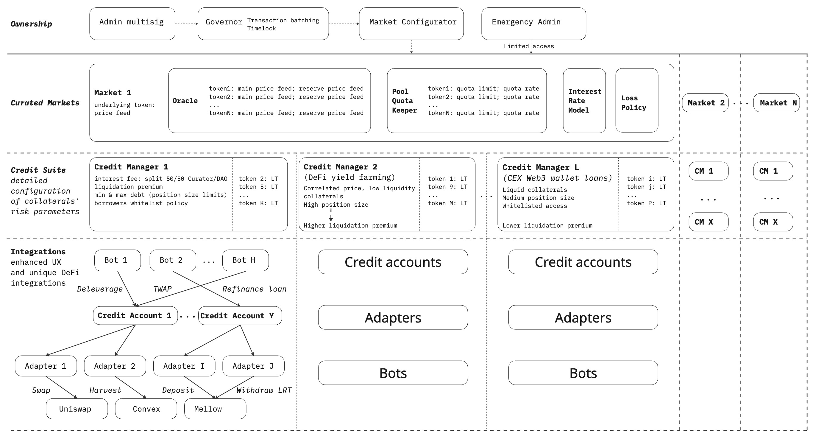

# Key concepts and system overview

With permissionless architecture Gearbox has became even more composable, evolving into a techical stack that allows growing lending businesses, developing DeFi ecosystems and deploy lending markets on any chain by enyone having interest and capacity to do so.

[https://permissionless.gearbox.foundation/](https://permissionless.gearbox.foundation/) is the entrypoint for no-code deployment, curation and collaboration with Gearbox.

### What is permissionless?

Anyone can deploy Market Configurator to create and manage Gearbox Markets without needing governance approval.&#x20;

### What is Gearbox Market?

Gearbox Market is a set of modular contracts allowing to facilitate lending, borrowing and productive usage of collaterals at rules set by Curator.\
Properties of a single market include but are not limited to Underlying Token, its Price Feed, Interest Rate Model, collateral-specific Limits and Additional Rates.

### What is Gearbox Instance?

Instance = Chain id activated by DAO for deployment + Chain-specific address of DAO Treasury + Instance Owner multisig that helps configure chain-specific parameters but can't affect Markets configuration.

### What can curator change?

The Curator can adjust all Market parameters, with a mandatory 24-hour timelock enforced at the smart-contract level for any changes.

### What is possible with permissionless curation?

Each market consists of tens of contracts, including Pool, Oracle, IRM, Loss policy, Credit Managers and Adapters. Such modular architecture allows creating products with market-best flexibility and granular parametrization making Gearbox Protocol the premier platform for crafting sophisticated financial products that address specific market demands and drive long-term value creation.

Below is a diagram of the contracts and parameters that a curator can configure, so you can get an idea of how detailed market configuration can be.

<figure><figcaption></figcaption></figure>
