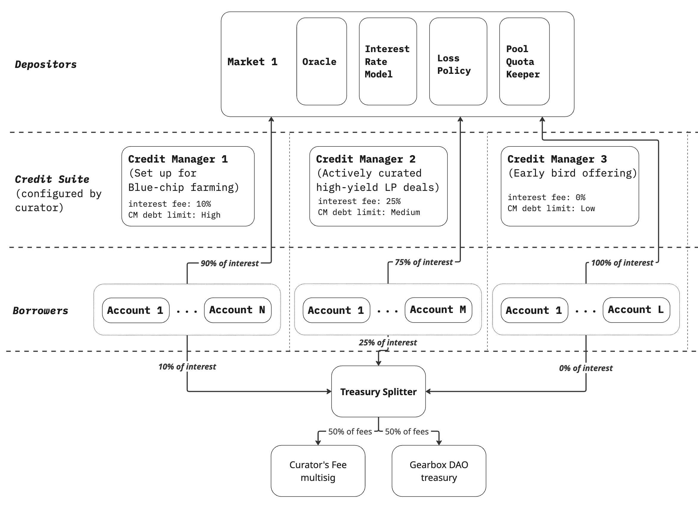

# Fee sharing

## What fees does Gearbox take?

* Interest Fee\
  Fee taken from the total interest paid by borrower. Paid when user repays debt
* Liquidation Fee\
  Fee taken from liquidated collateral

***

## Who set the fees value?

Both Interest Fee and Liquidation fee is controlled only by a Curator.

***

## Accrued fees as insurance buffer

Both Curator and DAO fees are accumulated on Treasury Splitter contract which is unique for every curator. Curator and DAO have to claim accrued fees from the contract.

If a liquidation happens with bad debt, fees from Treasury Splitter contract are burnt to cover loss, so unclaimed fees act as an insurance buffer.

***

## How is the fee split between Curator and Gearbox DAO?

All the fees taken by the protocol are split 50/50 between DAO and Curator by default.

To change this proportion both Gearbox DAO and Curator should sign transactions on TreasurySplitter contract (requires DAO proposal).

***

## Practical considerations

Both Interest and Liquidation fees are set on Credit Manager level. Some examples when it can be useful:

* Charge 0% fee on first 5,000,000 USDC borrowed:
  * Create Credit Manager with limit of 5,000,000 and set its fee to 0%
  * Once the limit is reached set it to 0. It will allow existing CM users to stay at 0% while disallowing new positions to be opened
  * Create a new Credit Manager with nonzero Interest Fee keeping other parameters untouched. That will result in new users opening positions with nonzero fee.
*   Charge higher fee for borrowing at exclusive terms:

    * Create Credit Manager specifically for collaterals with boosts negotiated by curator
    * Projects issuing the collateral may have private lp deals or offer higher rewards for position opened for specified period of time. Curator may charge additional fee for bringing the opportunity to borrowers

<figure><figcaption></figcaption></figure>
