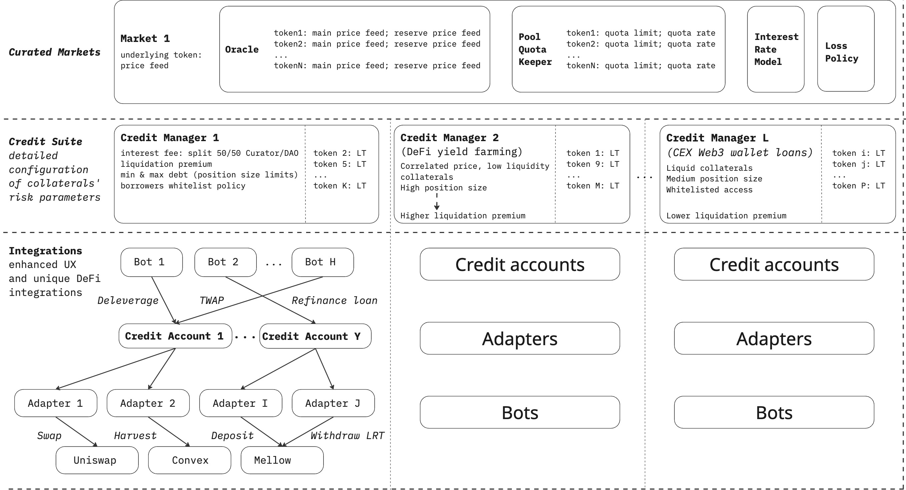

# Market

## What is Gearbox Market?

A Gearbox Market consists of modular smart contracts that enable highly customizable configuration of risk parameters for the Gearbox Protocol. These configurations are divided into three key areas:

* **Pool-Level Parameters**:
  * Price feeds for token pricing
  * Interest Rate Model
  * Collateral-specific rates and limits
* **Position-Level Parameters**, tailored to position size and collateral properties:
  * Liquidation thresholds
  * Liquidation premiums
  * Interest fees
* **Integrations Configuration.** Curators can define a list of external DeFi contracts that borrowers can interact with, enabling:
  * DEX swaps
  * Direct vault deposits and withdrawals
  * Unique staking integrations for non-tokenized positions (e.g., Convex, Infrared, and LSD withdrawal queues)

<figure><figcaption></figcaption></figure>
