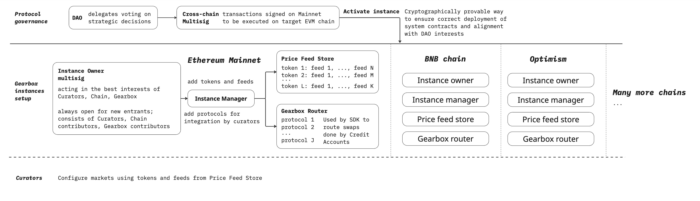

# Multichain architecture

## Multichain presense

Gearbox architecture allows day-0 creation of lending markets on any EVM chain. That is possible thanks to:

* **Cryptographically-proven deployment of audited contracts' bytecode**\
  All the protocol bytecode is stored onchain and signed by the auditors in the [Bytecode Repository](https://permissionless.gearbox.foundation/bytecode).
* **Minimal requirements for existing oracles**\
  Gearbox x Redstone integration allows permissionless day-0 usage of feeds on any chain. Chainlink, Redstone, Pyth and native support for DeFi collaterals reduce requirements. 
* **DeFi aggregation using Adapters and Router** \
  Functionality of 1Inch, CowSwap, Odos and other aggregators, that doesn't requre complex offchain infrastructure. All the chain's defi can be used directly from Credit Accounts.
* **Custom-built essential tooling**\
  From opensource Safe interface to scalable system of Anvil forks for testing & tools for intraday monitoring of protocol solvency and configuration correctness.

## Cross-chain governance

**Permissionless Curation Contracts** are designed to enable the Gearbox Protocol to function fully without active DAO involvement, with DAO influence restricted at the smart-contract level. The design follows these key principles:

* **Non-Interference with Decisions**: The DAO cannot influence or override decisions made by Curators or Instance Managers.
* **No Control Over Market Contracts**: Market contracts' parameters allow flexible modification by Curators, but the DAO cannot alter them.
* **Exclusive Control Over System Contract Versions**: Only the DAO can authorize new versions of system contracts (core protocol logic) for use. Adding adapters, price feeds, bots, or other components remains permissionless.
* **Chain Expansion Oversight**: Only the DAO can activate Gearbox on new chains, ensuring the correct Treasury address and Instance Owner multisig are set.

## Chain-specific governance

Different blockchain networks have unique characteristics, particularly in their oracles and ecosystem protocols, which are critical for the Gearbox Protocol’s integrations. 

The Instance Owner role is designed as a soft power mechanism to ensure Curators have access to a comprehensive and up-to-date list of chain-specific parameters, properly configured for each network.

The Instance Owner multisig initially includes 3 core Gearbox contributors and 9 Technical Multisig participants (crypto-founders and protocol supporters), with a signature threshold of 4. The goal is to include all relevant Curators and chain contributors as signers to prevent excessive censorship and  competition within the Instance Owner multisig.

To better understand the structure of both protocol-level and chain-specific governance, refer to the scheme below.

<figure><figcaption></figcaption></figure>
