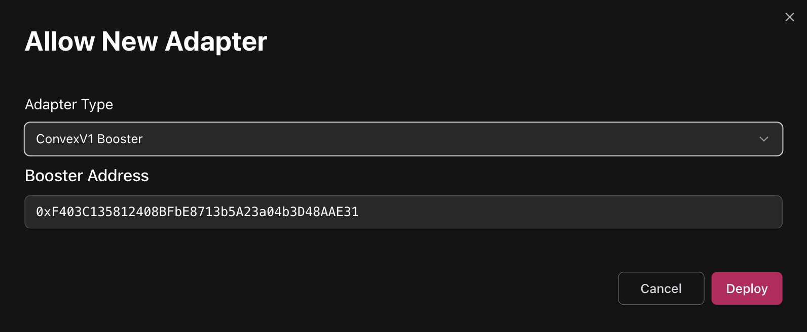

# Configuring Adapters

## What are adapters?

The Credit Account design enables active interaction with the DeFi ecosystem while borrowing — such as swapping tokens, depositing into vaults, claiming rewards, and more. However, allowing arbitrary operations poses security risks.&#x20;

> Adapters — modular contracts that enable secure, controlled interactions with external protocols.

## Why do curators need to configure adapters?

Having adapters properly configured in the market is essential for allowing collateral swaps, 1-click leverage and other UX features of Gearbox protocol.


Existing offchain infra (Front End, Liquidator) rely on router for finding paths from/to available collaterals. Router is not part of Gearbox protocol, therefore it’s not present in Bytecode repository. Router is used by Gearbox SDK to provide swap paths and it doesn’t interact with core contracts directly.


## What protocols are already integrated?

| Protocol                                                                                                                                                                                                                                                                                                                                                                            | Supported actions                                    |
| ----------------------------------------------------------------------------------------------------------------------------------------------------------------------------------------------------------------------------------------------------------------------------------------------------------------------------------------------------------------------------------- | ---------------------------------------------------- |
| 
<em><strong>Uniswap, Sushiswap, Oku Trade</strong></em> <a href="https://docs.gearbox.fi/gearbox-permissionless-doc/step-by-step-guides/configuring-adapters#uniswap-sushiswap-v2">V2</a>, <a href="https://docs.gearbox.fi/gearbox-permissionless-doc/step-by-step-guides/configuring-adapters#uniswap-sushiswap-pancakeswap-iguanadex-oku-trade-v3">V3</a>
              | Swaps                                                |
| 
<em><strong>Pancakeswap, IguanaDEX</strong></em> <a href="https://docs.gearbox.fi/gearbox-permissionless-doc/step-by-step-guides/configuring-adapters#uniswap-sushiswap-pancakeswap-iguanadex-oku-trade-v3">V3</a>, <a href="https://docs.gearbox.fi/gearbox-permissionless-doc/step-by-step-guides/configuring-adapters#pancakeswap-iguanadex-stableswap">StableSwap</a>
 | Swaps, Stableswap LP deposits                        |
| 
<em><strong>Balancer</strong></em> V2, V3
                                                                                                                                                                                                                                                                                                                                 | Swaps, V2 LP deposits                                |
| 
<em><strong>Curve</strong></em>  <a href="https://docs.gearbox.fi/gearbox-permissionless-doc/step-by-step-guides/configuring-adapters#curve-stableswap-cryptoswap-and-stableng">Stableswap, CryptoSwap, Stable NG</a>
                                                                                                                                                     | Swaps, LP deposits                                   |
| [_**Pendle**_](https://docs.gearbox.fi/gearbox-permissionless-doc/step-by-step-guides/configuring-adapters#curve-stableswap-cryptoswap-and-stableng)                                                                                                                                                                                                                                | PT swaps                                             |
| 
<em><strong>Mellow</strong></em> ERC4626 vaults, DVstETH, Wrapper deposits
                                                                                                                                                                                                                                                                                                | Instant deposits, Delayed withdrawals                |
| 
<em><strong>Velodrome, Aerodrome</strong></em>  V3, Stableswap
                                                                                                                                                                                                                                                                                                            | Swaps                                                |
| 
<em><strong>Camelot, Thena</strong> (Algebra AMM dexes)</em> V3
                                                                                                                                                                                                                                                                                                           | Swaps                                                |
| _**Napier**_                                                                                                                                                                                                                                                                                                                                                                        | PT Swaps, LP deposits                                |
| _**Convex**_                                                                                                                                                                                                                                                                                                                                                                        | Staking LP, claiming rewards                         |
| [_**Fluid DEX**_](https://docs.gearbox.fi/gearbox-permissionless-doc/step-by-step-guides/configuring-adapters#fluid-dex)                                                                                                                                                                                                                                                            | Swaps                                                |
| 
<em><strong>Camelot, Thena, Quickswap</strong></em> (Algebra AMM) V3
                                                                                                                                                                                                                                                                                                      | Swaps                                                |
| _**Trader Joe**_                                                                                                                                                                                                                                                                                                                                                                    | Swaps                                                |
| _**Infrared**_                                                                                                                                                                                                                                                                                                                                                                      | Staking LP, claiming rewards                         |
| _**Sky**_                                                                                                                                                                                                                                                                                                                                                                           | DAI - USDS conversion, Staking USDS for SKY          |
| _**Lido**_                                                                                                                                                                                                                                                                                                                                                                          | stETH - wstETH conversion                            |
| [_**ERC4626**_](https://docs.gearbox.fi/gearbox-permissionless-doc/step-by-step-guides/configuring-adapters#erc4626)                                                                                                                                                                                                                                                                | Instant deposits and withdrawals (whenever possible) |
| [_**Kodiak Island**_](https://docs.gearbox.fi/gearbox-permissionless-doc/step-by-step-guides/configuring-adapters#erc4626)                                                                                                                                                                                                                                                          | Deposit into Island, Swaps in pool                   |

All the source code and audit reports of the contracts can be found in [Bytecode Repository](https://permissionless.gearbox.foundation/bytecode). Use search, click on the target contract and then **View Source** or **View Report**. All the Adapters can be found by searching for the ADAPTER domain in Bytecode Repository.

<strong>Uniswap, Sushiswap V2</strong>

*   **Add UniswapV2 adapter (requires providing router address):**

    <figure><figcaption></figcaption></figure>

    * Uni V2 deployment addresses: [https://docs.uniswap.org/contracts/v2/reference/smart-contracts/v2-deployments](https://docs.uniswap.org/contracts/v2/reference/smart-contracts/v2-deployments)
    * Sushi V2 deployment addresses: [https://github.com/sushiswap/v2-core/tree/master/deployments](https://github.com/sushiswap/v2-core/tree/master/deployments)


Before allowing pools in adapter, please ensure that tokens from a pair are added as _**Assets to Market**_ and as _**Collaterals to Credit Manager**_.\
\
&#xNAN;_&#x65;.g. to add WETH/USDC pool both WETH and USDC must be added before._


*   **Configure adapter to whitelist pools:**

    <figure><figcaption></figcaption></figure>

    <figure><figcaption></figcaption></figure>

- Uni V2
  *   Configuration requires specifying tokens from a pair

      <figure><figcaption></figcaption></figure>
  * Sushi V2
    *   Configuration requires specifying tokens from a pair

        <figure><figcaption></figcaption></figure>

<strong>Uniswap, Sushiswap, Pancakeswap, IguanaDEX, Oku trade V3</strong>

*   **Add UniswapV3 adapter (requires providing SwapRouter address):**

    <figure><figcaption></figcaption></figure>

    * Uni V3 deployment addresses: [https://docs.uniswap.org/contracts/v3/reference/deployments/](https://docs.uniswap.org/contracts/v3/reference/deployments/)
    * Sushi V3 deployment addresses: [https://github.com/sushiswap/v3-periphery/tree/master/deployments](https://github.com/sushiswap/v3-periphery/tree/master/deployments)
    * Oku Trade deployment addresses: [https://docs.oku.trade/home/extra-information/deployed-contracts](https://docs.oku.trade/home/extra-information/deployed-contracts)
    * PancakeSwap deployment addresses: [https://developer.pancakeswap.finance/contracts/v3/addresses](https://developer.pancakeswap.finance/contracts/v3/addresses)
    * IguanaDEX deployment addresses: [https://docs.iguanadex.com/iguanadex-on-mainnet/contract-addresses](https://docs.iguanadex.com/iguanadex-on-mainnet/contract-addresses)


Router deployment must have bytecode of Uniswap's [SwapRouter.sol](https://github.com/Uniswap/v3-periphery/blob/v1.0.0/contracts/SwapRouter.sol) contract. Sometimes it has only [SwapRouter02](https://github.com/Uniswap/swap-router-contracts/blob/main/contracts/SwapRouter02.sol) deployment specified.\
\
On some chains that was already solved by deploying required implementation of router (see below).\
If it's not, reach out to Gearbox contributors.


* Custom SwapRouter deployments:
  * Uni V3
    * [BNB chain](https://bscscan.com/address/0xe7aC922b9751C7aca3A46D5505F36d5BbB1456b6#code)
  * asd
  * Oku Trade
    * [Etherlink](https://explorer.etherlink.com/address/0x2afB54fcaECd41BE4Ecd05d7bd2e193F2F05B99d?tab=contract)


Before allowing pools in adapter, please ensure that tokens from a pair are added as _**Assets to Market**_ and as _**Collaterals to Credit Manager**_.\
\
&#xNAN;_&#x65;.g. to add WETH/USDC pool both WETH and USDC must be added before._


*   **Configure adapter to whitelist pools:**\
    &#xNAN;_&#x43;onfiguration requires specifying tokens and fee from a pair_

    <figure><figcaption></figcaption></figure>

    <figure><figcaption></figcaption></figure>

-   Uni V3

    <figure><figcaption></figcaption></figure>
-   Sushi V3

    <figure><figcaption></figcaption></figure>
-   [PancakeSwap](https://pancakeswap.finance/info/v3/pairs), [IguanaDEX](https://www.iguanadex.com/info/v3?chain=etherlink)

    <figure><figcaption></figcaption></figure>

<strong>Velodrome, Aerodrome V3 (Slipstream)</strong>

*   **Add UniswapV3 adapter (requires providing SwapRouter address):**

    <figure><figcaption></figcaption></figure>

    * Velodrome V3 (Slipstream) multichain deployment addresses: [https://github.com/velodrome-finance/superchain-slipstream/blob/main/deployment-addresses](https://github.com/velodrome-finance/superchain-slipstream/blob/main/deployment-addresses)
    * Aerodrome V3 (Slipstream) [https://github.com/aerodrome-finance/slipstream?tab=readme-ov-file#deployment](https://github.com/aerodrome-finance/slipstream?tab=readme-ov-file#deployment)

-   **Configure adapter to whitelist pools:**\
    &#xNAN;_&#x43;onfiguration requires specifying tokens and fee from a pair_

    <figure><figcaption></figcaption></figure>

    <figure><figcaption></figcaption></figure>

*   Uni V3

    <figure><figcaption></figcaption></figure>
*   Sushi V3

    <figure><figcaption></figcaption></figure>
*   [PancakeSwap](https://pancakeswap.finance/info/v3/pairs), [IguanaDEX](https://www.iguanadex.com/info/v3?chain=etherlink)

    <figure><figcaption></figcaption></figure>

<strong>Curve StableSwap, CryptoSwap and StableNG</strong>

* **How to understand what's the type of the pool of interest:**
  1. Go to the block explorer page of Curve Address provider on a chain of interest:\
     [https://docs.curve.finance/deployments/integration/](https://docs.curve.finance/deployments/integration/)
  2. Call Address Provider's get\_address method with id = 7 to get address of MetaRegistry\
     On Mainnet MetaRegistry is located [here](https://etherscan.io/address/0xF98B45FA17DE75FB1aD0e7aFD971b0ca00e379fC).
  3. Call get\_registry\_handlers\_by\_pool of MetaRegistry, passing target pool address as argument.
  4. Check non-zero address from step 3. output. It usually has clues in first lines of its code.


Before adding adapter, please ensure that tokens from a pool and pool LP token itself are added as _**Assets to Market**_ and as _**Collaterals to Credit Manager**_.\
\
&#xNAN;_&#x65;.g. to add 3Pool (USDC/USDT/DAI) adapter both USDC, USDT, DAI and 3Pool token itself must be added before._\
\
_learn how to find pool's token address below._


*   _**If the pool is not Stable NG:**_\
    &#xNAN;_&#x53;elect Curve V1 2/3/4 Assets adapter depending on the number of different tokens in target pool:_

    <figure><figcaption></figcaption></figure>
*   _**If the pool is Stable NG:**_\
    &#xNAN;_&#x53;elect Curve StableNG adapter:_

    <figure><figcaption></figcaption></figure>


If the pool operates with non-erc20 ETH balance, deploy a ETH Gateway first and then pass it as target address.\
See the list of deployed gateways below and reach out to Gearbox team if the needed is not present.


* _**Adapter arguments:**_
  * **Target Address**
    *   The address of the pool

        <figure><figcaption></figcaption></figure>
  * **LP token**
    *   The address of the pool's LP token (may be different from pool itself)

        <figure><figcaption></figcaption></figure>
  * **Base Pool Address**
    * Applicable only if pool is a metapool.\
      Example: [this](https://www.curve.finance/dex/ethereum/pools/factory-v2-251/deposit/) pool has [FRAX/USDC](https://www.curve.finance/dex/ethereum/pools/fraxusdc/deposit/) as its base pool.
  * **Crypto Swap or PancakeSwap pool**
    * If Type of Pool is Crypto Swap (a.k.a Twocrypto/ Tricrypto) checkout this box.
* ETH Gateway deployments:
  * Mainnet:
    * [ETH/stETH pool](https://etherscan.io/address/0xdc24316b9ae028f1497c275eb9192a3ea0f67022) Gateway: 0x0675cb2066bacae2edfd09633d5b62be3c619a35

<strong>PancakeSwap/ IguanaDEX StableSwap</strong>


Before adding adapter, please ensure that tokens from a pool and pool LP token itself are added as _**Assets to Market**_ and as _**Collaterals to Credit Manager**_.\
\
&#xNAN;_&#x65;.g. to add USDX/USDT adapter both USDX, USDT and pool's LP token itself must be added before._\
\
_learn how to find pool's token address below._


*   **Select Curve V1 2 Assets adapter:**

    <figure><figcaption></figcaption></figure>

    * **Target Address**
      *   The address of the pool

          <figure><figcaption></figcaption></figure>
    * **LP token**
      *   The address of the pool's LP token (can be retreived by calling token() method of pool contract)

          <figure><figcaption></figcaption></figure>
    * **Base Pool Address**
      * Not applicable to PancakeSwap. Leave untouched.
    * **Crypto Swap or PancakeSwap pool**
      * Checkout this checkbox.

<strong>Pendle</strong>

*   **Add Pendle adapter (requires providing router address):**

    <figure><figcaption></figcaption></figure>
* Pendle deployment addresses: [https://github.com/pendle-finance/pendle-core-v2-public/blob/main/deployments](https://github.com/pendle-finance/pendle-core-v2-public/blob/main/deployments)


Before adding pool to adapter, please ensure that pool's input token and PT token are added as _**Assets to Market**_ and as _**Collaterals to Credit Manager**_.\
\
&#xNAN;_&#x65;.g. to add Pendle pool for PT-sUSDe, both sUSDe and PT-sUSDe must be added before._


*   **Configure adapter to whitelist pools:**\
    &#xNAN;_&#x43;onfiguration requires specifying market address and input/output tokens_

    <figure><figcaption></figcaption></figure>

    <figure><figcaption></figcaption></figure>
*   _**Market:**_

    <figure><figcaption></figcaption></figure>

    <figure><figcaption></figcaption></figure>

    <figure><figcaption></figcaption></figure>

    <figure><figcaption></figcaption></figure>
* _**Input token:**_\
  Select a token that is in the "1 SY Equals To" row on the screenshot above ^
* _**Pendle token:**_\
  Target PT token

<strong>Fluid DEX</strong>


Before adding pool to adapter, please ensure that pool's tokens are added as _**Assets to Market**_ and as _**Collaterals to Credit Manager**_.\
\
&#xNAN;_&#x65;.g. to add Fluid DEX for wstUSR/USDT, both wstUSR and USDT must be added._


*   **Add Fluid DEX adapter (requires providing DEX address)**

    <figure><figcaption></figcaption></figure>


If the pool includes ETH token, ETH Gateway must be deployed first and then be passed as target address to Fluid DEX adapter.


* Fluid deployment addresses: [https://github.com/Instadapp/fluid-contracts-public/blob/main/deployments/deployments.md](https://github.com/Instadapp/fluid-contracts-public/blob/main/deployments/deployments.md)


DEX addresses have names in the similar format: **Dex\_wstUSR\_USDT.** \
Search the name based on required tokens above.


* ETH Gateway deployments:
  * Mainnet:
    * #### Dex\_wstETH\_ETH: 0x9f294BF3201533B652aFb6B10c0385972C28a16f

<strong>ERC4626</strong>

<figure><figcaption></figcaption></figure>

Takes ERC4626 **Vault Address** as parameter. Target vault must be added as Asset to Market and as Collateral to Credit Manager.


Before adding adapter, please ensure that token being underlying asset of a ERC4626 vault is added as _**Assets to Market**_ and as _**Collaterals to Credit Manager**_.\
\
&#xNAN;_&#x65;.g. to add sDAI ERC4626 adapter DAI itself must be added before._


Operates using deposit, withdraw, mint and redeem functions of ERC4626 standard. Allows performing swaps from the vault’s **asset**  token into ERC4626 vault **share** token.


Sometimes tokens look very much like ERC4626 but with overwritten methods, like those implementing timelocked deposits and withdrawals. \
Note that this adapter works with vanilla standard methods only. \
\
e.g. sUSDe can be minted from USDe using ERC4626 deposit interface, but has timelocked withdrawals.


<strong>Kodiak Island</strong>

Takes Gateway Address as parameter. On Berachain it's 0x8d41361d340515d1cdd8c369ca7b5c79f6b2e9c9.

<figure><figcaption></figcaption></figure>

After adding adapter, click configure to whitelist particular Islands.


Before adding Island to adapter, please ensure that Island's tokens and Island itself are added as _**Assets to Market**_ and as _**Collaterals to Credit Manager**_.\
\
&#xNAN;_&#x65;.g. to add WBERA/iBERA Island, WBERA, iBERA and Island must be added._


<figure><figcaption></figcaption></figure>

<strong>Convex-staked Curve LP</strong>


Before adding and configuring Convex pool adapters, ensure that **Curve LP token**, **Convex Deposit Token**, **Staked Phantom Token**, **CRV** and **CVX** are added as collaterals to Market and Credit Manager (everything except **Staked Phantom Token** can have zero limit, LT and feed).\
\
\
**Convex Deposit Token** can be found by its symbol. If the Curve LP token has symbol frxUSDUSDf, then Convex deposit token will have symbol cvxfrxUSDUSDf.

**Staked Phantom Token** can be found by its symbol. If the Curve LP token has symbol frxUSDUSDf, then Convex deposit token will have symbol stkcvxfrxUSDUSDf.


**Add Convex Base Reward Pool adapter.**&#x20;

<figure><figcaption></figcaption></figure>

* _**Base Reward Pool Address:**_
  *   Rewards contract address from Convex pool Info.

      <figure><figcaption></figcaption></figure>

- _**Staked phantom token:**_
  * **Staked Phantom Token** can be found by its symbol. If the Curve LP token has symbol frxUSDUSDf, then Convex deposit token will have symbol stkcvxfrxUSDUSDf.

**Add Convex Booster adapter**


If the Credit Manager already includes the Convex Booster adapter, skip it and proceed to the next step (Update Convex booster Pool IDs).



Booster address is single across all chains and is suggested as default option.


<figure><figcaption></figcaption></figure>

**Update Convex booster Pool IDs**


After each new Convex pool is added, Booster pool ids should be updated.


<figure><figcaption></figcaption></figure>

<figure><figcaption></figcaption></figure>

\

